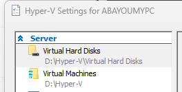


Serves installation
 
Hyper-V




## Enable Hyper-V :

1. Windows 10/11 Pro Computer with good amount of memory at least 16G, i have 32G and more is preferred 😃
2. Enable Hyper-v on Windows: Open PowerShell As Admin and run command and restart.

```PowerShell
Enable-WindowsOptionalFeature -Online -FeatureName Microsoft-Hyper-V -All
```

1. Download [Windows Server 2022 ISO](https://www.microsoft.com/en-us/evalcenter/evaluate-windows-server-2022)
2. Download [Windows 10 ISO](https://www.microsoft.com/software-download/windows10) or [Windows 11 ISO](https://www.microsoft.com/software-download/windows11)

I prefer to change Hyper-V default folder to D:\HYPER-V

```
D:\HYPER-V
├───Virtual Hard Disks
└───Virtual Machines
```

Copy all ISO's on one folder also

```
D:\IMAGES
   SERVER_2022_EVAL_x64FRE_en-us.iso
   Win10_ent.iso
   Win11_22H2_English_x64v1.iso
```

In Hyper-V Settings change path for Virtual Hard Disks & Virtual Machines.


## Create Hyper-V Nat Network & NAT Switch

This configuration will but all VM's on isolated subnet and allow them to access internet [Set up a NAT network | Microsoft Docs](https://docs.microsoft.com/en-us/virtualization/hyper-v-on-windows/user-guide/setup-nat-network)

Create new VMSwitch and name it NAT

```PowerShell
New-VMSwitch -SwitchName "NAT" -SwitchType Internal
```

List all network interface and note the interface ifIndex value of new create VMSwitch interface

```PowerShell
Get-NetAdapter
```

My Ethernet adaptor ifIndex = 46 and will use subnet 172.30.0.0/24 for NAT network.

```PowerShell
New-NetIPAddress -IPAddress 172.30.0.1 -PrefixLength 24 -InterfaceIndex 46
New-NetNat -Name NAT17230 -InternalIPInterfaceAddressPrefix 172.30.0.0/24
```

Use small DHCP server to auto configure IP on VM's on NAT network : [www.dhcpserver.de](https://www.dhcpserver.de/cms/download/)
